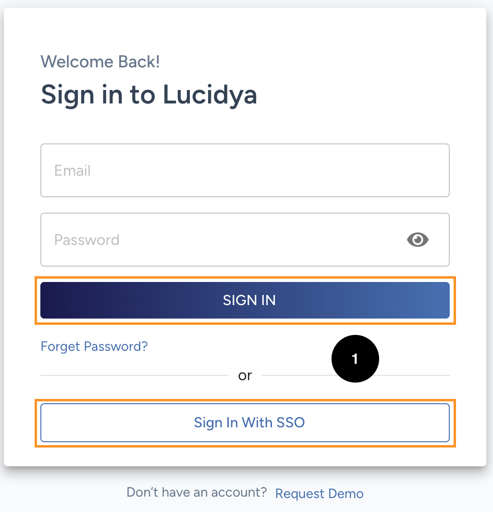
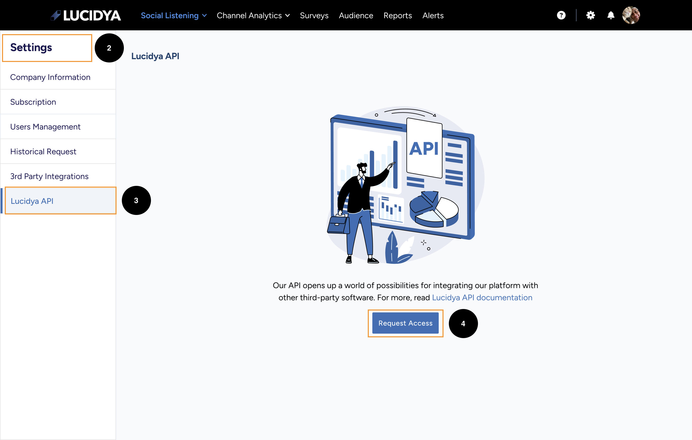
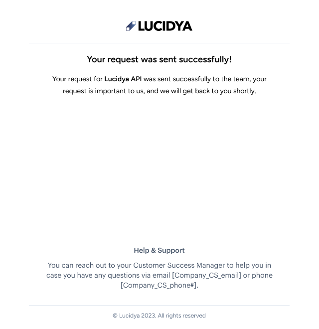
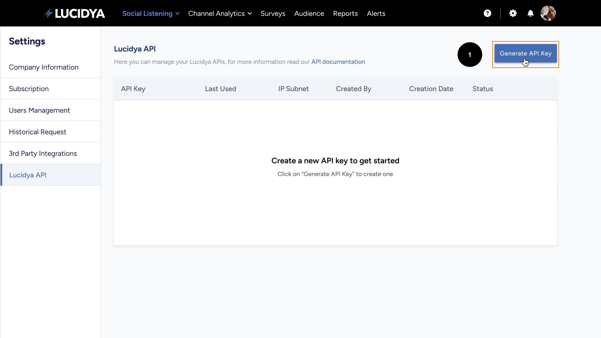
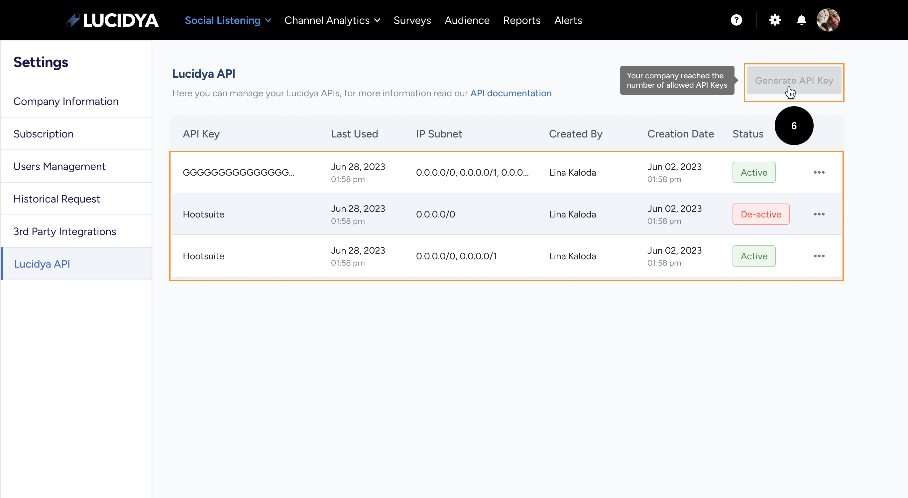
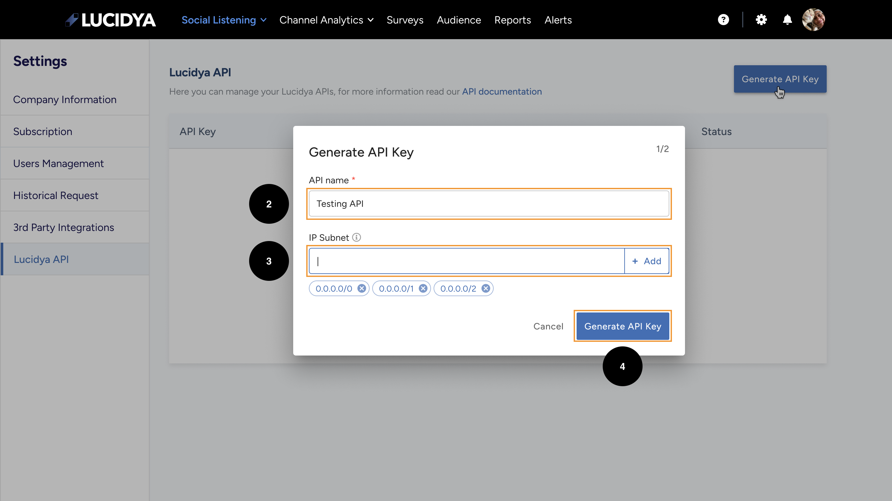
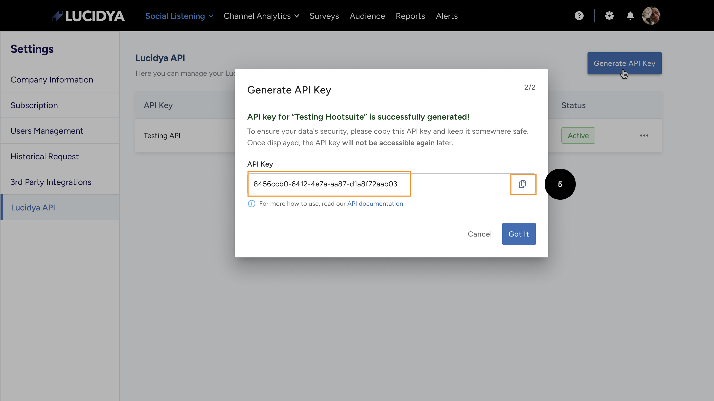

# 🔐 Authorization

---

The Lucidya API provides an **API token based authentication system**. To authenticate using a valid token, include your token under the **HTTP header** `luc-autharization` token.

```curl
  --request GET \
  --url 'https://api.lucidya.com/monitors_list?page_id=1' \
  --header 'luc-authorization: add_your_token_here'
```

## 🤔 How to request an API Token as a first time?

!!! tip "💡 Tip"
    **This step required as a first time only** by enabling you to access the API.

To access the Lucidya API, you must first have an **active account** with [Lucidya](https://lucidya.com/). Follow these steps to request an API key.

1. [**Login**](https://cxm.lucidya.com/login) to your account in Lucidya.
2. Navigate to the "**Settings**" page in your account.
3. Select "**Lucidya API**" from the left-side menu in the settings page.
4. Click on the "**Request Access**" button to receive an email for the updates of the request.
5. The Customer Success Manager associated with your account will update the request and you will receive an email for the updates.







## 🔑 How to generate an API key?

!!! tip "💡 Note"
    This is the after setting up your request access step.

Follow these steps to generate a new API key from your account.

1. [**Login**](https://cxm.lucidya.com/login) to your account in Lucidya.
2. Navigate to the "**Settings**" page in your account.
3. Select "**Lucidya API**" from the left-side menu in the settings page.
4. Now, You can find a new button to generate an API Key.
5. Click on the "**Generate API Key**" button to start generating a new API Key.


6. A popup will appear asking the you to add the **API Name** and **Subnet IP**.
7. Then another popup will appear containing the **API access token**. You can Copy this token for future use (But ONLY one time)
8. You can generate **up to 3 keys** in your account.


!!! tip "💡 Note"
    You can have multiple subnet IPs for the same Key.


!!! warning "🌐 API Access Token"
    Please copy the API Access Token to a secure place as you will not be able to view it again after closing the pop-up.

