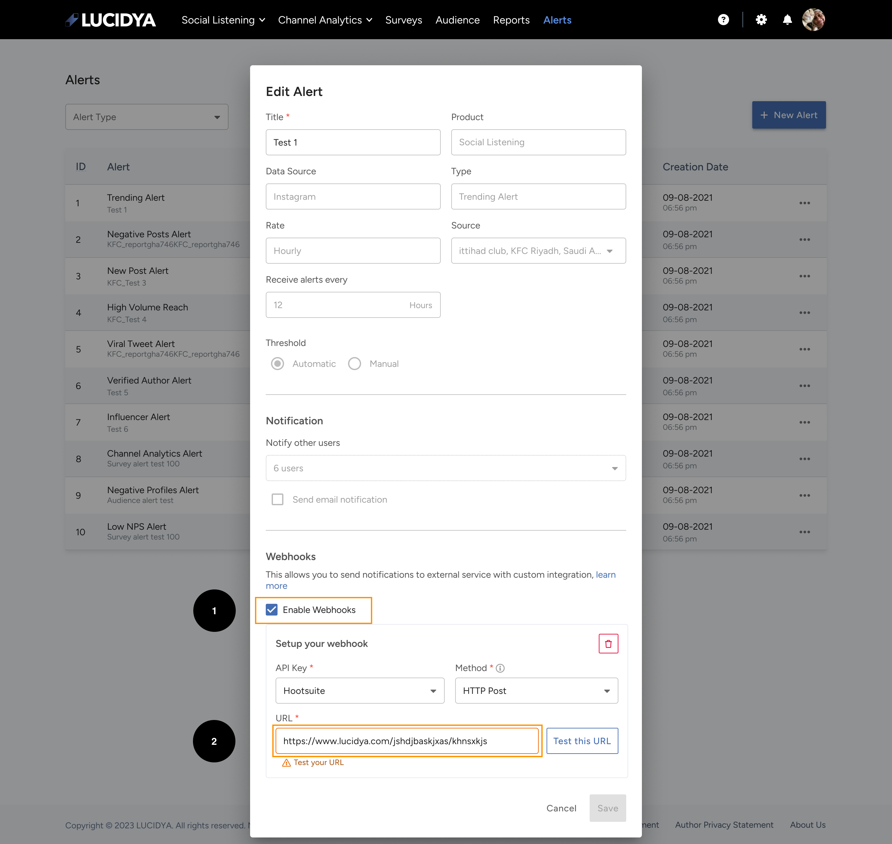

# 🔔 Get Started

---
The Lucidya API offers a powerful feature - real-time alerts. These alerts can notify you when specific events or conditions are met, enabling you to respond to changes in data swiftly and efficiently.

For users who have the Alerts feature enabled, an additional section will appear in the popup for creating an alert. This section enables users to add a webhook URL to receive alerts.

## 🔍 What is a Webhook?

Webhooks are a way for apps to communicate with each other automatically. They allow you to send real-time data from one application to another whenever a given event occurs. In the context of the Lucidya API, the webhook will be triggered whenever the conditions for an alert are met.

## 🤔 How to Set Up a Webhook for Lucidya API Alerts?

Setting up a webhook for your Lucidya API alerts involves adding the URL where you want the alert data to be sent.

1. Navigate to the Alerts section and click on '**Create an Alert**'.

2. Fill in the necessary details for your alert.

3. Enable Webhook Feature.

4. In the new section that appears, input your webhook URL.



!!! tip "💡 Test Webhook URL"
    Please note that the webhook URL should be tested before proceeding with the creation process. This is to ensure that the destination can receive the POST request from Lucidya's servers and handle the data appropriately.

!!! warning "💡 No Response"
    If there was no response for **15 days the webhook URL should be paused**.

## 🕹 Testing Your Webhook

To test your webhook, you can use tools such as Postman or curl. These tools allow you to send a POST request to your webhook URL and see the response. This helps verify that your server is correctly receiving the webhook data.

In conclusion, integrating webhooks into your Lucidya API alerts is a powerful way to stay updated with real-time data. Just remember to test your webhook URL before proceeding with the creation process to ensure smooth data transmission.

## 📢 Alert Responses

```javascript
{
   "Twitter__TrendingAlert__account_types":"{\"account_types\":[]}",
   "Twitter__TrendingAlert__dialects_and_sub_dialects":"{\"dialects\":[{\"name\":\"white\",\"value\":2}],\"sub_dialects\":[{\"name\":\"white\",\"value\":2}]}",
   "Twitter__TrendingAlert__header_alert_widget":"{\"net_sentiment\":\"neutral\",\"alert_level\":\"mild\",\"verified_authors\":1,\"negative_rate\":12.5,\"total_posts\":{\"value\":8,\"date\":\"2023-09-11 07:00:00\"},\"influencer_authors\":3,\"mentions_in_total\":8,\"total_reached_tweets\":null,\"total_reached_accounts\":null,\"increase_in_post_interactions\":0.0}",
   "Twitter__TrendingAlert__sentiment_analysis":"{\"sentiment_overtime\":{\"negative\":[{\"name\":1694512800.0,\"value\":0.3333333333333333}],\"positive\":[{\"name\":1694512800.0,\"value\":0}],\"neutral\":[{\"name\":1694512800.0,\"value\":0.6666666666666666}]},\"sentiment_piechart\":[{\"name\":\"positive\",\"value\":0},{\"name\":\"negative\",\"value\":1},{\"name\":\"neutral\",\"value\":2}]}",
   "Twitter__TrendingAlert__top_engagers":"{\"top_engagers\":[{\"id\":\"kah_aboud\",\"name\":\"عبدالرحمن\",\"data\":\"http://pbs.twimg.com/profile_images/1678432317407150081/G33l6zZ1_normal.jpg\",\"user_id\":1037466845241126912,\"verified\":\"false\",\"value\":1},{\"id\":\"kOUsvjXG6s1szPR\",\"name\":\"M Abo Wesam\",\"data\":\"http://pbs.twimg.com/profile_images/1552997103508529153/einbbr7I_normal.jpg\",\"user_id\":1164294407996301312,\"verified\":\"false\",\"value\":1},{\"id\":\"mhmad95236811\",\"name\":\"طارق الزهراني / بطل الاستثنائي 💙💙😍/66🏆🇸🇦💙\",\"data\":\"http://pbs.twimg.com/profile_images/1693071068657745920/WWKnt9Lg_normal.jpg\",\"user_id\":1257804632568586243,\"verified\":\"false\",\"value\":1}]}",
   "Twitter__TrendingAlert__top_hashtags":"{\"top_hashtags\":[]}",
   "Twitter__TrendingAlert__top_influencers":"{\"top_influencers\":[{\"id\":\"mhmad95236811\",\"name\":\"طارق الزهراني / بطل الاستثنائي 💙💙😍/66🏆🇸🇦💙\",\"data\":\"http://pbs.twimg.com/profile_images/1693071068657745920/WWKnt9Lg_normal.jpg\",\"verified\":\"false\",\"user_id\":1257804632568586243,\"value\":3769},{\"id\":\"kah_aboud\",\"name\":\"عبدالرحمن\",\"data\":\"http://pbs.twimg.com/profile_images/1678432317407150081/G33l6zZ1_normal.jpg\",\"verified\":\"false\",\"user_id\":1037466845241126912,\"value\":1077},{\"id\":\"kOUsvjXG6s1szPR\",\"name\":\"M Abo Wesam\",\"data\":\"http://pbs.twimg.com/profile_images/1552997103508529153/einbbr7I_normal.jpg\",\"verified\":\"false\",\"user_id\":1164294407996301312,\"value\":5}]}",
   "Twitter__TrendingAlert__top_keywords":"{\"top_keywords\":[{\"id\":\"العين\",\"stats_count\":1},{\"id\":\"القدم\",\"stats_count\":1},{\"id\":\"سواها\",\"stats_count\":1},{\"id\":\"قذر\",\"stats_count\":1},{\"id\":\"كرة\",\"stats_count\":1},{\"id\":\"ماهو\",\"stats_count\":1},{\"id\":\"هداف\",\"stats_count\":1},{\"id\":\"يجسد\",\"stats_count\":1}]}",
   "Twitter__TrendingAlert__top_verified_engagers":"{\"top_verified_engagers\":[]}",
   "Twitter__TrendingAlert__volume_overtime":"{\"posts_over_time\":[{\"name\":1694512800.0,\"value\":8}],\"total_posts_count\":8}"
}
```

## ❗️ Webhook Issues

1. When an issue happens from the user's other application side, an alert message will appear to the users to view the issue from the alerts page.

2. When enabling webhook, user view a validation messages about API Key is deactivated or webhook url is invalid. 
